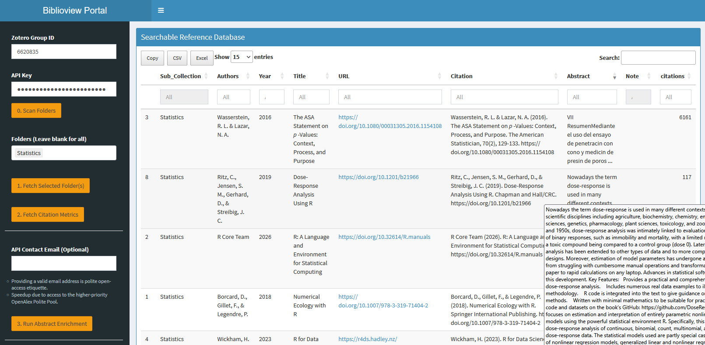
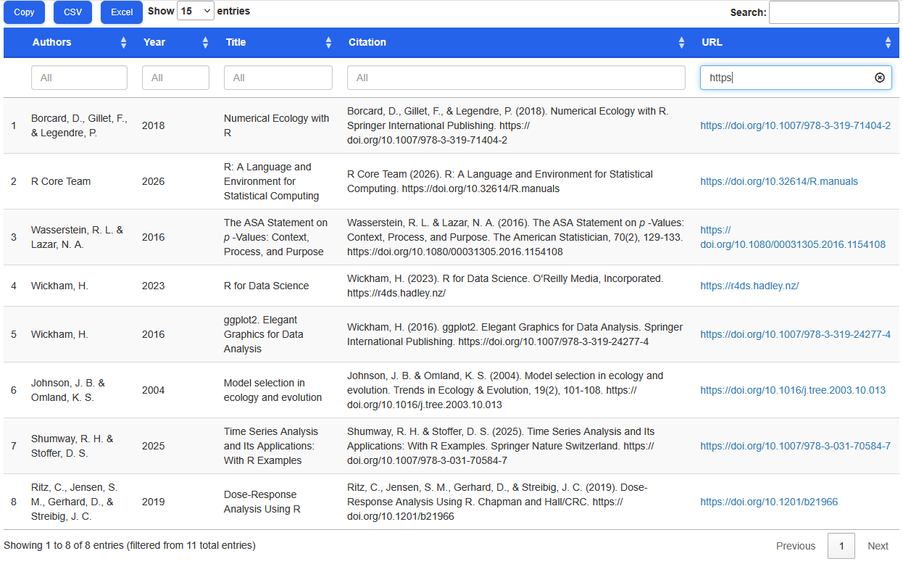

# Getting Started with biblioview

\*Note:\*\* This vignette is work in progress. It needs screenshots and
adaptation to the most recent app versions.

## Overview

The `biblioview` package provides a lightweight, performant Shiny
interface to display Zotero bibliographies in real time. Designed for
embedding inside Learning Management Systems (LMS) like OPAL, project
websites, or intranets, it allows research projects and course
instructors to maintain a **single source of truth** in Zotero without
requiring every student or collaborator to hold a Zotero account.

------------------------------------------------------------------------

## Part 1: Zotero Setup & API Credentials

To stream literature live into `biblioview`, you need a shared Zotero
Group Library and a read-only API Key.

### 1. Create a Group Library

1.  Log in to [zotero.org](https://www.zotero.org/) and go to **Groups**
    $`\rightarrow`$**Create a New Group**.
2.  Choose a name and set the privacy according to your needs:
    - **Public, Closed Membership:** Recommended for courses (anyone
      with the link/app can view, only you can edit).
    - **Private:** Strictly hidden from the web; requires an account or
      an API key to access.
3.  Note your **Group ID** from the group’s URL
    (`zotero.org/groups/<group_id>`).

### 2. Generate an API Key

1.  Go to **Account Settings** $`\rightarrow`$**Feeds/API**
    $`\rightarrow`$**Create new private key**.
2.  Set key permissions:
    - Give it a descriptive name (e.g., `biblioview-course`).
    - Check **Allow library access** for your target group.
3.  Copy the generated key string immediately and save it to a secure
    place.

> **Security Note:** Treat your API key like a password. Avoid
> hardcoding active API keys into publicly accessible repositories. In
> production, pass credentials using environment variables or
> application configuration files.

------------------------------------------------------------------------

## Part 2: Dynamic URL Parameters

`biblioview` supports URL parameters (query strings) to control which
literature subset is fetched and how the header is rendered. This allows
a **single Shiny app deployment** to serve multiple courses, project
modules, or web pages dynamically.

### Parameter Reference

| Parameter | Type | Required? | Description | Example Value |
|:---|:---|:---|:---|:---|
| `group` | String / Numeric | **Yes** | The Zotero Group ID containing your library. | `1234567` |
| `key` | String | **Yes** | Your Zotero read-only API key. | `a1b2c3d4e5f6...` |
| `folder` | String | *Optional* | The Zotero Collection ID (subfolder) to scope references to a specific module/course. | `A1B2C3D4` |
| `title` | String | *Optional* | Custom header title displayed above the bibliography table. | `Reading%20List` |

### Constructing the URL

``` text
[https://your-shiny-server.org/biblioview/?group=1234567&key=YOUR_API_KEY&folder=A1B2C3D4&title=Course%20Bibliography](https://your-shiny-server.org/biblioview/?group=1234567&key=YOUR_API_KEY&folder=A1B2C3D4&title=Course%20Bibliography)
```

If `folder` is omitted, `biblioview` defaults to fetching the entire
top-level group library. If `title` is omitted, it defaults to a
standard application header.

------------------------------------------------------------------------

## Part 3: Embedded Apps & User Workflows

`biblioview` provides two distinct app interfaces depending on your
deployment target.

### 1. The Full Overview App (Standalone)

Designed for research projects, complex students courses and
administrators who need full exploration capabilities.

- **Key Features:** Full-text search across titles and authors,
  expandable abstracts, direct DOI/URL links, and user-defined
  `Note:`-field in `extras`.
- Access data can be entered interactively or provided in the URL.
- Retrieves the available sub-collections (folders) and allows their
  dynamic selection.
- Supports enrichment of bib entries with citation counts and abstracts,
  retrieved from Crossref or OpenAlex.



### 2. The Embedded Reader App (LMS / OPAL / Iframe)

Designed specifically for `<iframe>` embedding in web pages or learning
management (LMS) platforms like OPAL or Moodle.

- **Key Features:** Compact vertical layout without menus, reduced
  number of columns, local caching (5 minutes) to reduce Zotero server
  load, support of customized CSS-styles.
- As it has no sidebar menu, it must always be called with URL
  parameters.

``` html
<!-- Example HTML Module Embed -->
<iframe 
  src="[https://your-shiny-server.org/biblioview-embed/?group=1234567&key=YOUR_KEY&folder=A1B2C3D4&title=Required%20Readings](https://your-shiny-server.org/bibliotable/?group=1234567&key=YOUR_KEY&folder=A1B2C3D4&title=Required%20Readings)" 
  width="100%" 
  height="600px" 
  frameborder="0">
</iframe>
```



------------------------------------------------------------------------

## Testing & Executable Examples

For local development or package testing (`R CMD check`), mock
credentials can be used in combination with offline fallback datasets to
ensure vignette compilation without live network calls:

``` r

library(biblioview)

# Example: Launching the app locally with demo parameters
if (interactive()) {
  launch_dashboard(
    group  = "0000000",
    key    = "INVALID_DEMO_KEY",
    folder = "DEMO123",
    title  = "Demo Literature View"
  )
}
```
