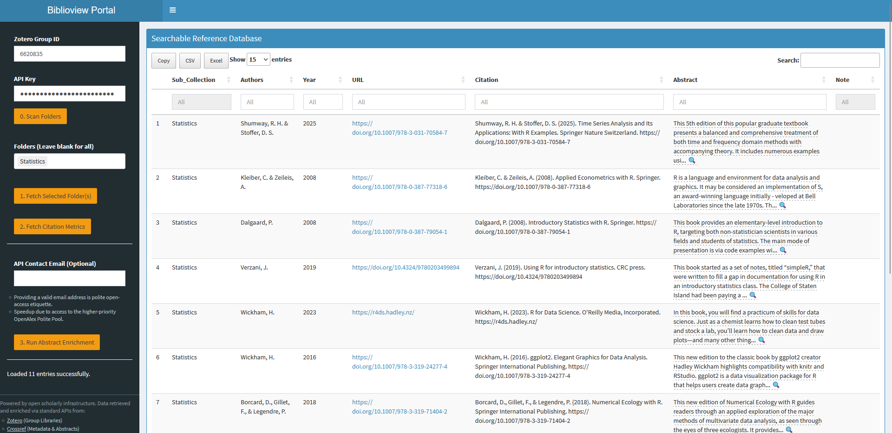

This guide walks you through using the interactive **biblioview** Shiny dashboard to explore, enrich, and export literature collections from a Zotero Group Library.

It assumes that you received a pre-configured dashboard link.

---

## 1. Getting Started via App Link

When you open a pre-configured dashboard link (containing parameters for `group`, `key`, and `folder`), the app automatically authenticates and pre-selects your target collection. Please wait a little until retrieval of bibliographic entries from Zotero is finished.

> 🔒 **Security Note on API Keys:** The API key is passed directly in the URL query string. It is essentially a password, so do not share or publish pre-configured links publicly!

---

## 2. Exploring and Interacting with the Library

Once your library loads into the main table, you have several interactive options:

* **Enable Full Page View:** Click the Hamburger Menu (☰) to toggle the control panel on and off.
* **Adjust Table Density:** Use the entries selector at the top left to expand the number of displayed records per page (e.g., from 10 to 50 or all rows).
* **Search, Sort and Filter:** Filter across all fields instantly using the global search box, or click any column header (such as *Year*, *Author*, or *Citations*) to sort.
* **Previewing Abstracts & Notes:** 
  * **Hover:** Move your mouse over truncated text cells marked with a magnifying glass (🔍) to read quick tooltips for long abstracts or notes.
  * **Enlarge & Export:** Double-click an abstract or note cell to pop up a standalone preview window for easy reading or copying.

---

## 3. Enriching Metadata

Use the step-by-step pipeline controls above the table to fetch live external metadata:

1. **Citation Metrics:** Click **Fetch Citation Metrics** to query the OpenAlex API in batch mode and pull in up-to-date citation counts. A value of -1 indicates that no citation count was found.
2. **Abstract Enrichment:** Click **Enrich Abstracts** to run a search (checking Crossref, OpenAlex, and Europe PMC) to automatically fill in missing abstract text. **Tip:** Providing an email address accesses the API's Polite Pool, which significantly speeds up retrieval and avoids rate limits.

> ℹ️ **Writing Back to Zotero:** By default, dashboard access is **read-only**. Writing retrieved abstracts back to the underlying library database can be done with a separate R function of the {biblioview} package and requires an API key with write permissions configured in the Zotero Security settings.

---

## 4. Changing Collections & Exporting

* **Switch Folders:** Select a different sub-collection folder from the dropdown menu at any time. Click **Fetch Library** to pull the updated dataset into the viewer.
* **Export Data:** Use the export buttons above the table to download your current filtered or full view as a **CSV** or **Excel** spreadsheet.

---

## 5. Editing References and Viewing PDFs (Zotero Workflow)

Full library editing and direct PDF reading take place within the Zotero client. Register at [Zotero]{https://zotero.org} and send your account name to the admin of the repective group library.

1. **Edit, Add or Import Items:** Add new references, correct bibliographic metadata, or attach PDF files using the Zotero Desktop App or Zotero Web Interface.
2. **Best Practices for Metadata:**
   * **DOIs & URLs:** Ensure DOIs are included whenever available (DOIs take precedence over raw web URLs during metric lookups).
   * **Custom Notes:** Add or edit extra annotations by inserting a `Note:` field in Zotero's **Extra** field.
3. **Syncing Updates:** Once changes are saved in Zotero, click **Fetch Library** in the **biblioview** dashboard after a brief sync delay to bring the updated references into your view.

